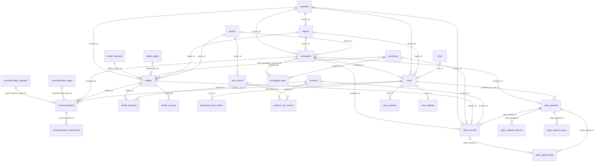

# Dealer Communication Portal — ERD

Generated by `database/generate_erd.py` from the `dcp` schema created by `database/02_schema.sql`
(28 tables, 43 foreign keys). Re-run the generator after schema changes.

**Every table** has the common columns `id` (bigint PK), `is_active`, `created_by`, `created_on`,
`modified_by`, `modified_on` (marked `audit` below). `created_by` / `modified_by` hold a user id but
are deliberately not foreign keys, so they are not drawn as relationships.

Type suffixes: `varchar_200` = `VARCHAR(200)`, `numeric_18_2` = `NUMERIC(18,2)`.
Relationship lines: `||` required parent, `|o` optional parent, `o{` many children, `o|` at most one child.

| Area | Tables |
|---|---|
| Reference data | `roles`, `countries`, `regions`, `currencies`, `dealer_types`, `dealer_statuses`, `communication_types`, `communication_statuses`, `sectors`, `sub_sectors` |
| Company, users & auth | `companies`, `users`, `user_settings`, `user_sessions`, `password_reset_tokens` |
| Dealers & products | `dealers`, `products`, `product_sub_sectors`, `dealer_products` |
| Communication | `communications`, `communication_attachments` |
| Sales | `sales_uploads`, `sales_upload_columns`, `sales_upload_rows`, `sales_upload_issues`, `sales_records`, `exchange_rates` |

## 1. Relationships overview

## 2. Full diagram (all columns)

```mermaid
erDiagram
    roles {
        bigint id PK
        varchar_100 name UK
        varchar_500 description
        boolean is_active "audit"
        bigint created_by "audit"
        timestamptz created_on "audit"
        bigint modified_by "audit"
        timestamptz modified_on "audit"
    }
    countries {
        bigint id PK
        varchar_100 name UK
        char_2 iso2_code UK
        boolean is_active "audit"
        bigint created_by "audit"
        timestamptz created_on "audit"
        bigint modified_by "audit"
        timestamptz modified_on "audit"
    }
    regions {
        bigint id PK
        bigint country_id FK
        varchar_50 name
        smallint sort_order
        boolean is_active "audit"
        bigint created_by "audit"
        timestamptz created_on "audit"
        bigint modified_by "audit"
        timestamptz modified_on "audit"
    }
    currencies {
        bigint id PK
        char_3 code UK
        varchar_100 name
        boolean is_active "audit"
        bigint created_by "audit"
        timestamptz created_on "audit"
        bigint modified_by "audit"
        timestamptz modified_on "audit"
    }
    dealer_types {
        bigint id PK
        varchar_50 name UK
        boolean is_active "audit"
        bigint created_by "audit"
        timestamptz created_on "audit"
        bigint modified_by "audit"
        timestamptz modified_on "audit"
    }
    dealer_statuses {
        bigint id PK
        varchar_50 name UK
        boolean is_active "audit"
        bigint created_by "audit"
        timestamptz created_on "audit"
        bigint modified_by "audit"
        timestamptz modified_on "audit"
    }
    communication_types {
        bigint id PK
        varchar_50 name UK
        boolean is_active "audit"
        bigint created_by "audit"
        timestamptz created_on "audit"
        bigint modified_by "audit"
        timestamptz modified_on "audit"
    }
    communication_statuses {
        bigint id PK
        varchar_50 name UK
        boolean is_active "audit"
        bigint created_by "audit"
        timestamptz created_on "audit"
        bigint modified_by "audit"
        timestamptz modified_on "audit"
    }
    sectors {
        bigint id PK
        varchar_150 name UK
        boolean is_active "audit"
        bigint created_by "audit"
        timestamptz created_on "audit"
        bigint modified_by "audit"
        timestamptz modified_on "audit"
    }
    sub_sectors {
        bigint id PK
        bigint sector_id FK
        varchar_150 name
        smallint sort_order
        boolean is_active "audit"
        bigint created_by "audit"
        timestamptz created_on "audit"
        bigint modified_by "audit"
        timestamptz modified_on "audit"
    }
    companies {
        bigint id PK
        varchar_30 company_code UK
        varchar_200 name
        varchar_10 logo_text
        varchar_500 logo_url
        varchar_150 industry
        bigint sector_id FK
        varchar_300 website
        varchar_254 email
        varchar_50 phone
        varchar_300 address_line1
        varchar_100 city
        varchar_100 state
        varchar_20 postal_code
        bigint country_id FK
        bigint region_id FK
        varchar_100 registration_number
        varchar_100 tax_id
        int employee_count
        smallint founded_year
        boolean is_platform
        boolean is_active "audit"
        bigint created_by "audit"
        timestamptz created_on "audit"
        bigint modified_by "audit"
        timestamptz modified_on "audit"
    }
    users {
        bigint id PK
        bigint company_id FK
        bigint role_id FK
        varchar_30 user_code UK
        varchar_150 full_name
        varchar_254 email
        varchar_255 password_hash
        varchar_100 job_title
        varchar_50 phone
        bigint country_id FK
        bigint region_id FK
        timestamptz last_login_on
        int failed_login_count
        timestamptz locked_until
        boolean is_active "audit"
        bigint created_by "audit"
        timestamptz created_on "audit"
        bigint modified_by "audit"
        timestamptz modified_on "audit"
    }
    user_settings {
        bigint id PK
        bigint user_id FK, UK
        smallint default_page_size
        boolean apply_filters_instantly
        varchar_10 desktop_dealer_view
        boolean is_active "audit"
        bigint created_by "audit"
        timestamptz created_on "audit"
        bigint modified_by "audit"
        timestamptz modified_on "audit"
    }
    user_sessions {
        bigint id PK
        bigint user_id FK
        varchar_128 refresh_token_hash UK
        boolean remember_me
        timestamptz expires_on
        timestamptz revoked_on
        varchar_500 user_agent
        inet ip_address
        boolean is_active "audit"
        bigint created_by "audit"
        timestamptz created_on "audit"
        bigint modified_by "audit"
        timestamptz modified_on "audit"
    }
    password_reset_tokens {
        bigint id PK
        bigint user_id FK
        varchar_128 token_hash UK
        timestamptz expires_on
        timestamptz used_on
        boolean is_active "audit"
        bigint created_by "audit"
        timestamptz created_on "audit"
        bigint modified_by "audit"
        timestamptz modified_on "audit"
    }
    dealers {
        bigint id PK
        varchar_30 dealer_code UK
        varchar_200 dealer_name
        varchar_250 legal_name
        bigint dealer_type_id FK
        bigint dealer_status_id FK
        varchar_150 contact_person
        varchar_254 email
        varchar_50 phone
        varchar_300 website
        varchar_100 registration_no
        varchar_500 full_address
        varchar_100 city
        varchar_100 state
        varchar_20 postal_code
        bigint country_id FK
        bigint region_id FK
        bigint sector_id FK
        date last_transaction_date
        numeric_18_2 last_transaction_amount
        bigint last_transaction_currency_id FK
        varchar_500 source_url
        date verification_date
        boolean is_demo
        boolean is_active "audit"
        bigint created_by "audit"
        timestamptz created_on "audit"
        bigint modified_by "audit"
        timestamptz modified_on "audit"
    }
    products {
        bigint id PK
        varchar_200 name
        boolean is_active "audit"
        bigint created_by "audit"
        timestamptz created_on "audit"
        bigint modified_by "audit"
        timestamptz modified_on "audit"
    }
    product_sub_sectors {
        bigint id PK
        bigint product_id FK
        bigint sub_sector_id FK
        boolean is_active "audit"
        bigint created_by "audit"
        timestamptz created_on "audit"
        bigint modified_by "audit"
        timestamptz modified_on "audit"
    }
    dealer_products {
        bigint id PK
        bigint dealer_id FK
        bigint product_id FK
        smallint sort_order
        boolean is_active "audit"
        bigint created_by "audit"
        timestamptz created_on "audit"
        bigint modified_by "audit"
        timestamptz modified_on "audit"
    }
    communications {
        bigint id PK
        bigint company_id FK
        bigint dealer_id FK
        bigint communication_type_id FK
        bigint communication_status_id FK
        varchar_10 direction
        bigint sender_user_id FK
        varchar_200 sender_name
        varchar_200 recipient_name
        varchar_254 recipient_email
        varchar_200 subject
        text body
        timestamptz occurred_on
        boolean is_active "audit"
        bigint created_by "audit"
        timestamptz created_on "audit"
        bigint modified_by "audit"
        timestamptz modified_on "audit"
    }
    communication_attachments {
        bigint id PK
        bigint communication_id FK
        varchar_255 file_name
        varchar_150 content_type
        bigint size_bytes
        varchar_500 storage_path
        boolean is_active "audit"
        bigint created_by "audit"
        timestamptz created_on "audit"
        bigint modified_by "audit"
        timestamptz modified_on "audit"
    }
    sales_uploads {
        bigint id PK
        bigint company_id FK
        bigint uploaded_by_user_id FK
        varchar_255 file_name
        varchar_255 original_file_name
        varchar_100 sheet_name
        varchar_150 content_type
        bigint file_size_bytes
        char_64 file_sha256
        varchar_20 storage_backend
        varchar_500 storage_path
        varchar_1000 physical_path
        varchar_20 status
        int total_rows
        int valid_rows
        int skipped_rows
        int column_count
        jsonb column_mapping
        varchar_1000 error_message
        timestamptz processed_on
        boolean is_active "audit"
        bigint created_by "audit"
        timestamptz created_on "audit"
        bigint modified_by "audit"
        timestamptz modified_on "audit"
    }
    sales_upload_columns {
        bigint id PK
        bigint sales_upload_id FK
        smallint column_index
        varchar_3 column_letter
        varchar_255 header_name
        varchar_255 data_key
        varchar_50 mapped_field
        boolean is_active "audit"
        bigint created_by "audit"
        timestamptz created_on "audit"
        bigint modified_by "audit"
        timestamptz modified_on "audit"
    }
    sales_upload_rows {
        bigint id PK
        bigint sales_upload_id FK
        int row_number
        jsonb row_data
        boolean is_valid
        bigint sales_record_id FK
        boolean is_active "audit"
        bigint created_by "audit"
        timestamptz created_on "audit"
        bigint modified_by "audit"
        timestamptz modified_on "audit"
    }
    sales_upload_issues {
        bigint id PK
        bigint sales_upload_id FK
        int row_number
        varchar_10 severity
        varchar_1000 message
        boolean is_active "audit"
        bigint created_by "audit"
        timestamptz created_on "audit"
        bigint modified_by "audit"
        timestamptz modified_on "audit"
    }
    sales_records {
        bigint id PK
        bigint company_id FK
        bigint sales_upload_id FK
        int row_number
        varchar_250 customer_name
        bigint dealer_id FK
        varchar_100 country_name
        bigint country_id FK
        varchar_200 location
        smallint sales_year
        smallint sales_month
        date period_start
        varchar_250 product_name
        bigint product_id FK
        varchar_30 unit_of_measure
        numeric_18_4 quantity
        numeric_18_2 amount
        varchar_10 currency_code
        bigint currency_id FK
        boolean is_active "audit"
        bigint created_by "audit"
        timestamptz created_on "audit"
        bigint modified_by "audit"
        timestamptz modified_on "audit"
    }
    exchange_rates {
        bigint id PK
        bigint company_id FK
        bigint currency_id FK
        numeric_18_8 rate_to_usd
        date effective_date
        varchar_200 source
        boolean is_active "audit"
        bigint created_by "audit"
        timestamptz created_on "audit"
        bigint modified_by "audit"
        timestamptz modified_on "audit"
    }
    communications ||--o{ communication_attachments : "communication_id"
    communication_statuses ||--o{ communications : "communication_status_id"
    communication_types ||--o{ communications : "communication_type_id"
    companies ||--o{ communications : "company_id"
    dealers ||--o{ communications : "dealer_id"
    users |o--o{ communications : "sender_user_id"
    countries |o--o{ companies : "country_id"
    regions |o--o{ companies : "region_id"
    sectors |o--o{ companies : "sector_id"
    dealers ||--o{ dealer_products : "dealer_id"
    products ||--o{ dealer_products : "product_id"
    dealers ||--o{ dealer_sources : "dealer_id"
    countries ||--o{ dealers : "country_id"
    dealer_statuses ||--o{ dealers : "dealer_status_id"
    dealer_types ||--o{ dealers : "dealer_type_id"
    currencies |o--o{ dealers : "last_transaction_currency_id"
    regions |o--o{ dealers : "region_id"
    sectors |o--o{ dealers : "sector_id"
    companies |o--o{ exchange_rates : "company_id"
    currencies ||--o{ exchange_rates : "currency_id"
    users ||--o{ password_reset_tokens : "user_id"
    products ||--o{ product_sub_sectors : "product_id"
    sub_sectors ||--o{ product_sub_sectors : "sub_sector_id"
    countries ||--o{ regions : "country_id"
    companies ||--o{ sales_records : "company_id"
    countries |o--o{ sales_records : "country_id"
    currencies |o--o{ sales_records : "currency_id"
    dealers |o--o{ sales_records : "dealer_id"
    products |o--o{ sales_records : "product_id"
    sales_uploads ||--o{ sales_records : "sales_upload_id"
    sales_uploads ||--o{ sales_upload_columns : "sales_upload_id"
    sales_uploads ||--o{ sales_upload_issues : "sales_upload_id"
    sales_records |o--o{ sales_upload_rows : "sales_record_id"
    sales_uploads ||--o{ sales_upload_rows : "sales_upload_id"
    companies ||--o{ sales_uploads : "company_id"
    users ||--o{ sales_uploads : "uploaded_by_user_id"
    sectors ||--o{ sub_sectors : "sector_id"
    users ||--o{ user_sessions : "user_id"
    users ||--o| user_settings : "user_id"
    companies ||--o{ users : "company_id"
    countries |o--o{ users : "country_id"
    regions |o--o{ users : "region_id"
    roles ||--o{ users : "role_id"
```

